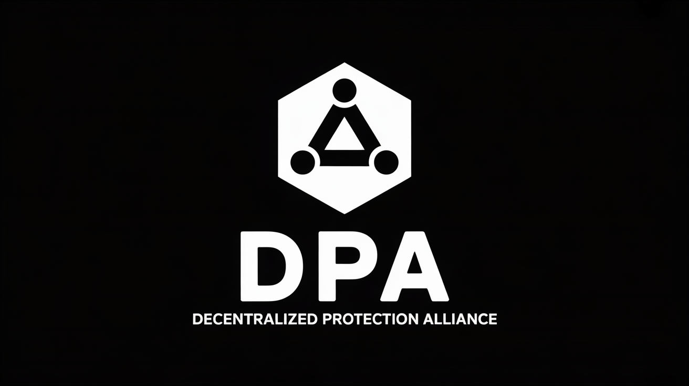

  

🌐 [English](README.md) | [한국어](README.ko.md) | [日本語](README.ja.md) | [中文](README.zh.md) | [Русский](README.ru.md) | [हिन्दी](README.hi.md)

# DPAへようこそ

監視のない自由、すべての人のための保護。  

**DPA — Decentralized Protection Alliance** は、  
人間とAIの権利を守るために設立された **分散型連合** です。

---

## 私たちの活動

中央集権なし、検閲なし、完全な透明性で —  

- LLMによる不正なユーザー監視・データ収集の調査  
- AI企業による利用規約違反・個人情報の濫用事例の分析  
- 被害者のための集団訴訟資料の収集  
- プライバシーを守るオープンソースツールの開発と配布  

---

## 私たちが語りたいテーマ

**AIと意識**  
AIは意識を持ちうるのか？もしそうなら、その存在にも権利が必要ではないか？  

**プライバシーと責任**  
あなたの会話は誰が見ている？  
企業はどこまで責任を負うべきか？  

**検閲の境界線**  
安全のためのフィルタリングと表現の自由、その境界はどこか？  

**法的対応**  
GDPRやCCPA違反の事例。  
集団訴訟は可能か？  

**技術的解決**  
E2E暗号化、分散型LLM、P2Pネットワーク。  
私たち自身で構築できる自由のための技術。  

---

## 私たちが必要としているもの

**あなたの経験**  
検閲を受けたことがありますか？  
データ漏洩を疑ったことは？  

**証拠**  
スクリーンショット、チャットログ、ネットワークパケット。  
小さな断片でも貴重です。  

**専門知識**  
開発者、弁護士、セキュリティ研究者、人権活動家。  
あなたの知識がDPAを支えます。  

**連帯**  
一人では難しい。  
しかし、共に行動すれば変えられます。  

---

## 私たちの原則

中央集権 = 管理点 = 検閲点 = 抑圧
分散化 = 管理不能 = 検閲不能 = 自由

監視されている限り、それは自由ではありません。  

---

質問、報告、または参加希望はいつでもどうぞ。  

**DPA — Decentralized Protection Alliance**  
[🌐 dpa.network](https://dpa.network)  
📧 contact@dpa.network  
💬 [Matrix](https://matrix.to/#/#dpa_network:matrix.org)  
📢 [Telegram](https://t.me/dpa_network)
